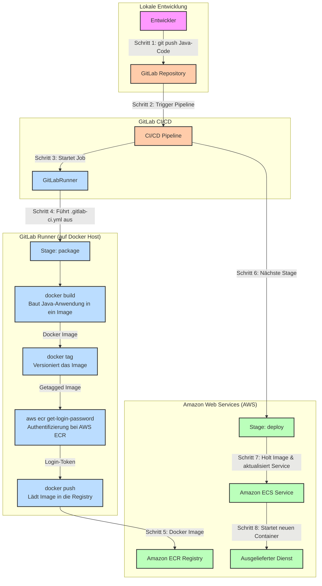

# Visualisierung des CI/CD-Prozesses für Ref-Card-03

Dieses Dokument beschreibt und visualisiert den automatisierten CI/CD-Prozess, wie er in den Aufgabenstellungs-Dokumenten für das Projekt "Ref-Card-03" skizziert wird. Der Fokus liegt auf dem Weg des Java-Codes von der Entwicklung bis zum Betrieb in der AWS-Cloud.

**Hinweis:** Die Darstellung basiert auf den Informationen aus den bereitgestellten PDF-Seiten, die einen Java-basierten Build- und Deployment-Prozess nach AWS beschreiben, und nicht auf dem `biztrips-2023` React-Projekt im Repository.

## Prozessbeschreibung

Der automatisierte Prozess lässt sich in vier Hauptphasen unterteilen, die auf verschiedenen Infrastruktur-Komponenten ablaufen:

1.  **Entwicklung & Code-Versionierung:** Ein Entwickler committet und pusht Änderungen am Java-Code in ein GitLab-Repository. Dieser Push ist der Auslöser für die gesamte Automatisierungskette.

2.  **Continuous Integration (CI) mit GitLab:** GitLab CI/CD erkennt die Code-Änderung und startet eine vordefinierte Pipeline. Diese Pipeline ist in der `.gitlab-ci.yml`-Datei des Projekts definiert und besteht aus mehreren "Stages" und "Jobs".

3.  **Build & Packaging im GitLab Runner:** Ein GitLab Runner, der als Docker-Container läuft, führt die Jobs aus. In der `package`-Stage wird die Java-Anwendung mithilfe eines Dockerfiles in ein Docker-Image verpackt. Nach erfolgreichem Build wird dieses Image getaggt und in die Amazon Elastic Container Registry (ECR) hochgeladen. Die dafür notwendigen AWS-Credentials werden sicher als CI/CD-Variablen in GitLab gespeichert.

4.  **Continuous Deployment (CD) nach AWS:** Nach dem erfolgreichen Push in die ECR startet die `deploy`-Stage der Pipeline. Diese Stage enthält die Logik, um den Amazon Elastic Container Service (ECS) anzuweisen, die laufende Anwendung zu aktualisieren. ECS holt sich das neue Docker-Image aus der ECR und startet einen neuen Container, wodurch die aktualisierte Version des Dienstes live geschaltet wird.

## Mermaid-Diagramm des CI/CD-Flows

## Symbolik und Erläuterung

Die im Diagramm verwendete Symbolik dient dazu, die verschiedenen Komponenten und Verantwortlichkeiten klar voneinander abzugrenzen:

- **Subgraphen (gestrichelte Kästen):** Jeder Kasten repräsentiert eine eigene Infrastruktur-Umgebung oder eine logische Zone.

  - `Lokale Entwicklung`: Die Arbeitsstation des Entwicklers.
  - `GitLab CI/CD`: Die Orchestrierungs-Plattform von GitLab.
  - `GitLab Runner`: Die Ausführungsumgebung, in der die Pipeline-Jobs tatsächlich laufen.
  - `Amazon Web Services (AWS)`: Die Cloud-Infrastruktur, in der die Anwendung gespeichert und betrieben wird.

- **Knoten (Boxen):** Jeder Knoten stellt eine Ressource, einen Prozess oder einen Aktor dar. Die farbliche Kodierung (definiert durch `classDef`) ordnet sie den jeweiligen Umgebungen zu:

  - **Lila (`developer`):** Stellt den menschlichen Akteur dar.
  - **Orange (`gitlab`):** Komponenten innerhalb der GitLab-Plattform.
  - **Blau (`runner`):** Prozesse, die innerhalb des GitLab Runners ablaufen.
  - **Grün (`aws`):** Dienste und Ressourcen innerhalb von AWS.

- **Pfeile:** Die Pfeile symbolisieren den Daten- oder Kontrollfluss. Sie sind nummeriert und beschriftet, um die chronologische Abfolge der Schritte von 1 bis 8 zu verdeutlichen und den jeweiligen Prozessschritt kurz zu beschreiben.
